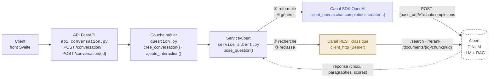

# MQC → Albert : parcours d'un appel

Depuis les deux routes de `src/api/api_conversation.py` (`POST /conversation/` et
`POST /conversation/{id_conversation}`)
jusqu'aux appels sortants vers Albert — via le SDK OpenAI d'un côté, l'API REST « classique » d'Albert de l'autre.
Les deux routes convergent immédiatement vers la même logique, `ServiceAlbert.pose_question()`.

## Le détail des 4 appels dans pose_question()

### ① Reformulation de la question — SDK OpenAI

`ReformulateurDeQuestion.reformule()` reconstruit la question à partir de l'historique de conversation, puis l'envoie au
modèle de reformulation.

Si la réponse est `QUESTION_NON_COMPRISE`, le flux s'arrête ici : une `ViolationQuestionNonComprise` est renvoyée sans
qu'aucun autre appel ne soit fait.

`question/reformulateur_de_question.py:19 → infra/albert/client_albert.py:212 (modele_reformulation)`

### ② Recherche des paragraphes pertinents — REST

`recherche_paragraphes()` interroge la collection ANSSI (recherche `hybrid` ou `semantic` selon la configuration).

`services/service_albert.py:79 → infra/albert/client_albert.py:114 · POST /search`

### ②b Recherche « jeopardy » (optionnelle, si jeopardy_active)

Recherche dans une seconde collection, puis pour chaque résultat un appel supplémentaire pour récupérer le chunk
complet ; les résultats sont fusionnés et dédoublonnés avec ceux de l'étape ②.

`service_albert.py:137 → POST /search (collection jeopardy) · GET /documents/{id_document}/chunks/{id_chunk} (un appel par résultat)`

### ③ Reclassement des paragraphes — REST (si reclassement_active)

`reclasse()` envoie les paragraphes candidats au modèle de reclassement ; les résultats sont retriés par score, puis
filtrés sur les « réponses maîtrisées » (FAQ) au-delà d'un seuil.

`service_albert.py:212, :286 → infra/albert/client_albert.py:179 · POST /rerank`

### ④ Génération de la réponse — SDK OpenAI

Les paragraphes retenus sont injectés dans le prompt système, avec l'historique de conversation limité à
taille_fenetre_historique échanges, puis envoyés au modèle de réponse.

`service_albert.py:226 → infra/albert/client_albert.py:212 (modele_reponse)`

### ⑤ Analyse de la réponse — local (aucun appel réseau)

Détection des marqueurs texte (`ERREUR_IDENTITÉ`, `ERREUR_THÉMATIQUE`, `ERREUR_MALVEILLANCE`, `ERREUR_MECONNAISSANCE`)
pour transformer la réponse en violation si besoin.

`service_albert.py:317`

### ⑥ Retour au client — local

La conversation est sauvegardée en base, l'événement est consigné dans le journal, puis `api_conversation.py` renvoie
une `200/201 JSON` — ou une `HTTPException` en cas d'erreur.

`question.py:90-119 → api_conversation.py:66-81, :114-133`

## Erreurs de communication avec Albert

| Exception                     | 	Déclenchée par	                                                             | Type d'erreur         | 	Code HTTP |
|-------------------------------|------------------------------------------------------------------------------|-----------------------|------------|
| ErreurRechercheDocuments	     | échec de POST /search (étape 2)	                                             | COMMUNICATION_ALBERT	 | **500**        |
| ErreurCommunicationAlbert	    | échec de POST /rerank (étape 3)	                                             | COMMUNICATION_ALBERT	 | **500**        |
| ErreurCommunicationModele	    | timeout / erreur de connexion sur chat.completions.create (étapes 1 et 4)	   | COMMUNICATION_ALBERT	 | **500**        |
| Exception générique	          | toute autre erreur imprévue dans le flux	                                    | INCONNU	              | **422**        |
| ResultatConversationInconnue	 | id_conversation absent de la base (route POST /conversation/{id} uniquement)	 | —	                    | **404**        |/
