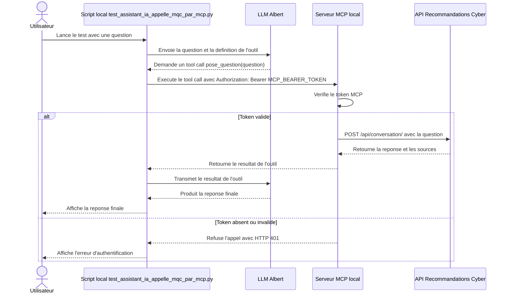

# POC MCP local authentifie

Ce document décrit le POC MCP local qui expose l'outil `pose_question` et le
protege avec un token bearer.

## Flux de bout en bout

Le LLM Albert ne contacte pas directement le serveur MCP local. Il demande un
appel d'outil. Le script local `scripts/test_assistant_ia_appelle_mqc_par_mcp.py`
execute ensuite cet appel vers le serveur MCP avec le token `MCP_BEARER_TOKEN`.



## Variables utiles

Ajoutez ces variables dans `.env` avant de lancer les scripts locaux :

```env
MCP_BEARER_TOKEN=token-local-de-test
MCP_HOST=127.0.0.1
MCP_PORT=8001
MCP_API_BASE_URL=http://127.0.0.1:3001
MCP_API_TIMEOUT=30
ALBERT_MODELE_CLIENT=mistral-medium-2508
```

## Lancer le POC

### 1. Lancer l'application

Dans un premier terminal lancer l'application.
Attendez que le backend soit disponible sur `http://127.0.0.1:3001`.

### 2. Lancer le serveur MCP local

Dans un second terminal :

```bash
$env:MCP_BEARER_TOKEN = "token-local-de-test"
$env:MCP_API_BASE_URL = "http://127.0.0.1:3001"
uv run python src/serveur_mcp.py
```

Le serveur MCP écoute sur `http://127.0.0.1:8001/mcp`.

### 3. Tester le bout en bout Albert -> MCP -> API

Dans un troisième terminal :

```powershell
$env:MCP_BEARER_TOKEN = "token-local-de-test"
$env:ALBERT_MODELE_CLIENT = "mistral-medium-2508"
uv run python scripts/test_assistant_ia_appelle_mqc_par_mcp.py "Quelles sont les bonnes pratiques pour sécuriser mes mots de passe ?"
```

Sortie attendue : une réponse finale en langage naturel produite par Albert a
partir du résultat retourné par l'outil MCP.

```text
Utilisez un gestionnaire de mots de passe...
```

## Verifier le refus avec un mauvais token

Gardez le serveur MCP lancé avec le bon token, puis exécutez :

```powershell
uv run python scripts/test_assistant_ia_appelle_mqc_par_mcp.py `
  --mcp-token "mauvais-token" `
  --albert-model mistral-medium-2508 `
  "Quelles sont les bonnes pratiques pour sécuriser mes mots de passe ?"
```

Le script doit échouer au moment d'exécuter le tool call MCP, avec une erreur
HTTP `401`.

Vous pouvez aussi tester directement :

```bash
curl -X POST http://127.0.0.1:8001/mcp `
  -H "Authorization: Bearer mauvais-token"
```

Réponse attendue :

```json
{"error":"invalid_token","error_description":"Authentication required"}
```

## Ce que valide le POC

Ce POC valide qu'un client MCP local (en cible l'assistant IA) doit posséder le token pour appeler le serveur MCP. Il ne prouve pas qu'un LLM distant précis est le seul appelant possible : dans ce flux, le détenteur du token est le client local qui execute les `tool calls` demandés par Albert.

## MCP Inspector

Exécuter le bash suivant

```bash
npx @modelcontextprotocol/inspector \
  uv \
  --directory src \
  run \
  serveur_mcp
```